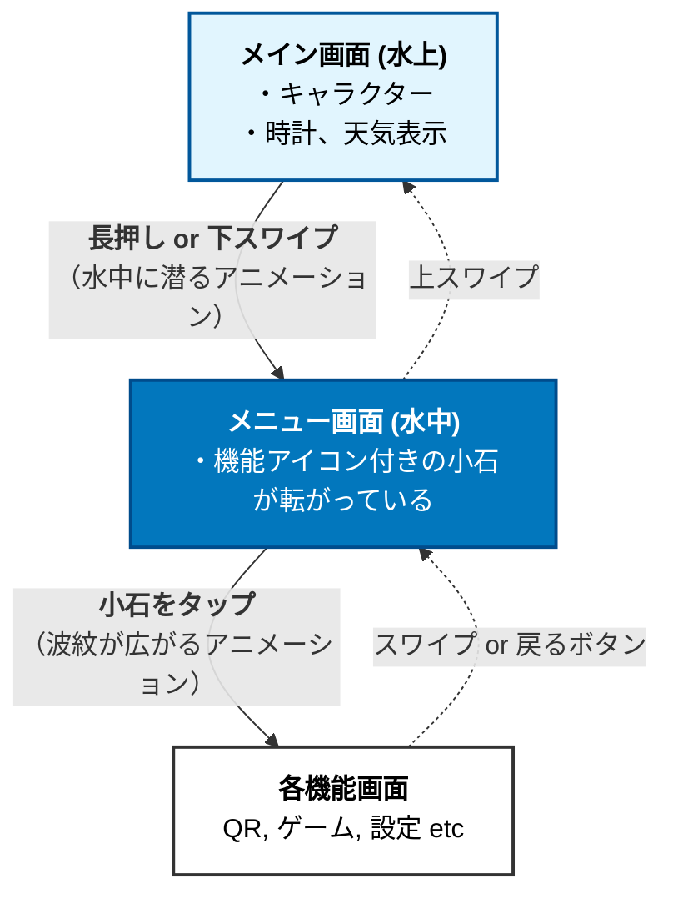

# alcedo-pebble
1.28インチの円形タッチディスプレイを搭載した、キーホルダーとして日常的に持ち運べる小型デバイス「Alcedo Pebble (アルセド ぺブル)」

## 使用ソフトウェアバージョン
- SquareLine Studio v1.5.4
  - BOARD PROPERTIES: Arduino with TFT_eSPI v1.1.2, LVGL: 8.3.11
- 

ポータブルキーホルダーデバイス「Alcedo Pebble」企画書
## 1. 企画趣旨
1.28インチの円形タッチディスプレイを搭載した，キーホルダーとして日常的に持ち運べる小型デバイス「Alcedo Pebble (アルセド ぺブル)」を開発する．
個人のウェブサイトへ誘導するQRコードの表示，簡単なゲーム，好きなキャラクターのアニメーション表示といった機能を実装し，コミュニケーションのきっかけや日々の癒やしを提供することを目的とする．
実用性よりも，所有する楽しさや愛着，パーソナライズできる点を重視する．
## 2. プロジェクト名について
- 名前: Alcedo Pebble (アルセド ぺブル)
- 由来:
- Alcedo: 制作者のモチーフであるカワセミ (Alcedo atthis) から．
- Pebble: 川辺にある「小石」のように，自然と手に馴染む，丸くて親しみやすい存在であってほしいという願いを込めて．
## 3. デバイススペック
### 3.1. ボード主要コンポーネント
[ESP32-S3-Touch-LCD-1.28 User Guide](https://spotpear.com/wiki/ESP32-S3-1.28inch-Round-LCD-Display-TouchScreen.html)
- MCU: ESP32-S3R2 (WiFi/Bluetooth SoC, 240MHz, 2MB PSRAM内蔵)
- Flash: W25Q128JVSIQ (16MB NOR-Flash)
- USB-UART: CH343P
- LDO: ME6217C33M5G (800mA, 低ドロップアウト)(解像度:240×240)
- 充電IC: ETA6096 (リチウム電池充電チップ)
- IMU: QMI8658 (6軸慣性測定ユニット: 3軸ジャイロ + 3軸加速度)
- ディスプレイ: 1.28インチ 円形ディスプレイ（タッチ機能付き）
### 3.2. インターフェース・その他
- バッテリー: MX1.25 2P コネクタ (3.7Vリチウム電池対応)
- USB: USB Type-C (USB1.1 ホスト/デバイス サポート)
- ボタン: RESETボタン，BOOTボタン (ダウンロードモード用)
### 3.3. 外部接続コンポーネント
- モータ: リニアバイブレーションモータ
- バイブレーションモータドライバ: [DRV2605L Haptic Driver Datasheet (PDF)](https://www.ti.com/lit/ds/symlink/drv2605l.pdf)
- バッテリ: リチウムポリマーバッテリー 500mAh
### 3.4 ピンアサイン

- UART0: PCとのシリアル通信
- I2C0: LCD，QMI8658
- I2C1: DRV2605L

| ESP32-S3R2 | LCD | SH1.0 | MX1.25 | QMI8658 | other |
| :--- | :--- | :--- | :--- | :--- | :--- |
| GPIO0 | | | | | BOOT0 |
| GPIO1 | | | ADC | | |
| GPIO2 | LCD_BL | | | | |
| GPIO3 | | | | INT2 | |
| GPIO4 | | | | INT1 | MOSFET1_CS |
| GPIO5 | TP_INT | | | | MOSFET2_CS |
| GPIO6 | TP_SDA | | | SDA | |
| GPIO7 | TP_SCL | | | SCL | |
| GPIO8 | LCD_DC | | | | |
| GPIO9 | LCD_CS | | | | |
| GPIO10 | LCD_CLK | | | | |
| GPIO11 | LCD_MOSI | | | | |
| GPIO12 | LCD_MISO | | | | |
| GPIO13 | TP_RST | | | | |
| GPIO14 | LCD_RST | | | | |
| GPIO15 | | GPIO15 | | | DRV2605L_SDA |
| GPIO16 | | GPIO16 | | | DRV2605L_SCL |
| GPIO17 | | GPIO17 | | | |
| GPIO18 | | GPIO18 | | | |
| GPIO19 | | | | | |
| GPIO20 | | | | | |
| GPIO21 | | GPIO21 | | | |
| GPIO33 | | GPIO33 | | | |

## 4. 機能
- QRコード表示: 自己紹介やウェブサイトへのリンクを表示します．
- ミニゲーム: センサーを使ったシンプルなゲーム（1〜2種類）．
- サイコロ: デバイスを振る
- ぺブル・スキップ（水切りゲーム）
  - 内容: デバイスを手首のスナップを効かせて「えいっ」と振ります．その加速度や角度を読み取って，画面上の石が水面を何回跳ねたかを競うゲームです．軸のブレと，回転の速さで判定します．
  - 面白さ: 「Pebble（小石）」という名前にぴったりなゲームです．石が跳ねるたびに振動させると，爽快感が出ます．
- 時計: アナログ・デジタルなど，複数のデザインから選べるウォッチフェイス．キャラクターが時間を教えてくれるデザインも良いですね．
- 歩数計: その日の歩数を記録します．キャラクターの成長要素と連動させると面白そうです．
- 天気予報: Wi-Fiに接続し，現在地の天気をアイコンで表示します．キャラクターが傘をさすなどのアニメーションも可愛いですね．
- 簡易通知: スマートフォンとBluetoothで連携し，電話着信やLINEの通知をアイコンだけで知らせます（内容は見ない）．
- 設定: Wi-Fi設定，画面の明るさ，バイブレーションのON/OFFなど．

## 5. UI/UXコンセプト：「水面と水中の世界」
「カワセミのいる川辺」という世界観をUI全体で表現する．デバイスを「水面（メイン画面）」と「水中（メニュー画面）」の二層構造で捉え，物理的な操作と連動させることで，触っていて楽しい体験を目指す．
- メイン画面（水上）
- デザイン: 穏やかな川の水面を背景とし，中央にキャラクターを配置する．背景は時間帯や天候と連動して変化する．
- インタラクション: デバイスを傾けると水面やキャラクターが揺れる．画面をタップすると波紋が広がる．
- メニュー画面（水中）
- 画面遷移: メイン画面を長押し，または下スワイプすると，「ポチャン」という効果音と共に水中に潜るアニメーションで遷移する．
- デザイン: 水中には機能アイコンが刻まれた小石（Pebble）が複数配置される．
- インタラクション: デバイスを傾けると，物理演算に従って小石が画面内を転がる．目的の小石をタップして機能を決定する．
- UI構成図

## 6. ソフトウェア設計方針
メンテナンス性と拡張性を高めるため，役割ごとにクラスを分割した設計を採用する．
- AlcedoPebble: アプリケーション全体を統括する．
- SceneManager: メイン画面，メニュー画面といった各場面（シーン）の切り替えを管理する．
- Scene: 各場面の基底クラス．
- Device: ディスプレイやセンサーなどのハードウェアを抽象化する．
- Character: キャラクターのアニメーションや状態を専門に管理する．
- PhysicsEngine: メニュー画面での物理演算など，専門的な計算を行う．

todo
